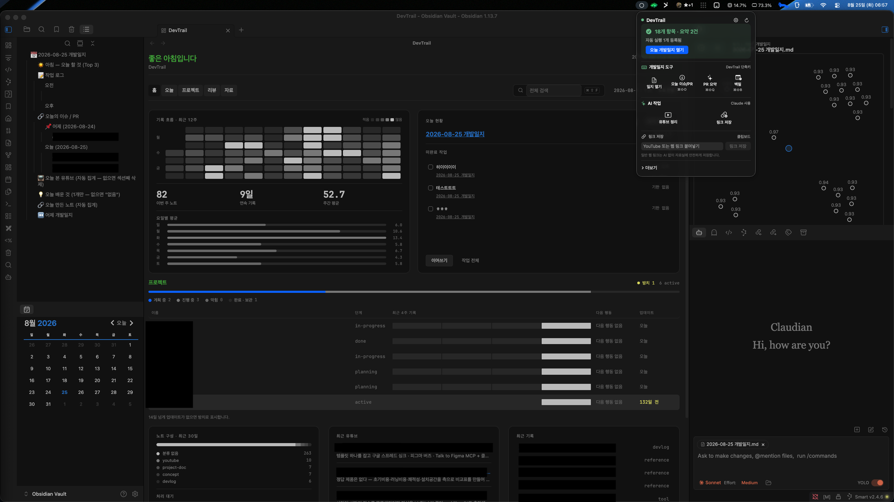

# DevTrail

[](https://github.com/p-changki/devtrail/actions/workflows/ci.yml)

*[**한국어**](README.md) · [English](README.en.md)*

> 개발한 것, 배운 것, 참고한 것을 오늘 기록하고 매주 다시 꺼내 쓰는, 개발자를 위한 로컬 제2의 뇌

DevTrail은 **방대한 개인 자료를 빠르게 모으고, 다시 꺼내 적용할 수 있게 만드는 로컬 Markdown 작업 환경**입니다. macOS용 CLI·메뉴바 앱·Obsidian Command Center를 묶어 GitHub 활동, 개발일지, 프로젝트 문서, 웹·YouTube 자료를 하나의 흐름으로 연결합니다.

Obsidian이 처음인 개발자·취준생·1인 개발자부터, AI와 Markdown으로 바이브코딩하는 사람까지 바로 시작할 수 있습니다. 복잡한 폴더 규칙을 외우기보다 오늘의 개발일지에서 작업을 시작하고, 자료실에 쌓인 나만의 문서·링크·학습 기록을 필요할 때 검색해 적용합니다. 모든 기록은 사용자의 볼트에 로컬 파일로 남습니다.



_오늘의 기록, 프로젝트, 자료실을 Obsidian 대시보드와 메뉴바 앱에서 함께 봅니다._

> **현재 macOS 베타입니다.** [DevTrail 0.7.0 베타 DMG 다운로드](https://github.com/p-changki/devtrail/releases/tag/v0.7.0) · 사용 후기와 버그는 [Issues](https://github.com/p-changki/devtrail/issues)로 알려 주세요.

## 누구를 위한 도구인가

- Obsidian을 처음 쓰거나 기록 체계를 만들고 싶은 개발자
- GitHub 작업, 개발일지, 프로젝트 문서, 학습 자료를 한 볼트에서 쓰고 싶은 사람
- macOS에서 개인 로컬 Markdown 환경을 선호하는 사람

Raindrop·Readwise·Web Clipper를 대체하는 범용 서비스는 아닙니다. 링크를 모으는 입구보다, 모은 자료를 개발일지와 주간 회고에서 다시 쓰는 흐름에 집중합니다.

## 베타 설치와 5분 시작

### 가장 쉬운 방법 — macOS 앱

1. [릴리즈 페이지](https://github.com/p-changki/devtrail/releases/tag/v0.7.0)에서 `DevTrail-0.7.0.dmg`를 내려받습니다.
2. DMG를 열어 **DevTrail**을 **Applications**로 드래그합니다.
3. Applications에서 DevTrail을 **control-클릭 → 열기**로 처음 한 번 실행합니다.
4. 메뉴바의 DevTrail에서 볼트를 고르고 **안전한 설정 확인**을 누릅니다.

이 베타는 아직 Apple 공증 전입니다. macOS가 앱을 열지 못한다고 하면, 릴리즈의 SHA-256을 확인한 뒤에만 아래 명령을 한 번 실행하세요.

```bash
xattr -dr com.apple.quarantine /Applications/DevTrail.app
```

### CLI로 시작

```bash
curl -fsSL https://raw.githubusercontent.com/p-changki/devtrail/main/install.sh | bash
devtrail init
```

처음 실행하면 볼트와 언어를 고르고, 기존 볼트에 안전하게 얹을지 새로 시작할지 선택합니다. 메뉴바 앱에서는 오늘 기록, GitHub 활동, 링크 저장을 바로 실행합니다.

1. 볼트 선택
2. 안전한 설정 확인
3. 오늘 개발일지 만들기
4. 링크 또는 빠른 메모 저장
5. Obsidian 대시보드 열기

기존 노트는 이동하거나 덮어쓰지 않습니다. 적용 전에는 변경 내용을 미리 볼 수 있고, 적용한 변경은 `devtrail undo`로 되돌릴 수 있습니다.

## 핵심 흐름

| 지금 할 일 | DevTrail이 하는 일 |
|---|---|
| 오늘 개발일지 | 템플릿 생성, GitHub 이슈·PR 반영, AI 선택 요약 |
| 프로젝트 문서 | 레포 문서를 볼트에 동기화하고 단계별로 표시 |
| YouTube 링크 | 자막을 읽을 수 있으면 선택한 AI로 요약·분류 |
| 일반 웹 링크 | AI 없이 제목·설명·Open Graph를 저장하고 분야별 자료실에 정리 |
| 주간 회고 | 이번 주 기록을 바탕으로 초안을 생성 |

### 링크 자료실

메뉴바의 **링크 저장**에 URL을 붙여넣거나 아래 명령을 사용하세요.

```bash
devtrail capture web --url https://example.com        # 미리 보기만
devtrail capture web --url https://example.com --apply
devtrail capture web --organize --apply                # 기존 미분류 링크 재정리
```

링크는 `type`·분야·주제·자유 태그·도메인으로 정리됩니다. 개발 문서, 도구, 디자인 레퍼런스, 아이콘·에셋, 데이터 자료, 코딩 연습처럼 근거가 분명한 경우에만 자동 분류하고, 확신이 없으면 **미분류**로 남깁니다. 저장 뒤에는 입력칸이 비워져 다음 링크를 바로 붙여넣을 수 있습니다.

## 안전성 약속

- 기본은 **dry-run**이며 `--apply`가 있을 때만 파일을 바꿉니다.
- 기존 노트·폴더·Obsidian 설정을 덮어쓰지 않고 병합합니다.
- 변경은 저널에 남고 `devtrail undo`로 확인·되돌릴 수 있습니다.
- 일반 웹 링크 저장에는 AI, API 키, 유료 서비스가 필요 없습니다.
- AI 기능은 선택 사항이며 실행 중·성공·실패 상태를 메뉴바에 표시합니다.

## 구성과 요구사항

- **macOS**, Obsidian, `git`, `jq`가 필요합니다.
- GitHub 활동은 `gh auth login` 후 사용할 수 있습니다.
- 필수 Obsidian 플러그인: Shell commands, Templater, Dataview, Auto Note Mover.
- `DevTrail Command Center`는 CLI가 만드는 경로 맵을 읽는 Obsidian 플러그인입니다. 현재 Community Plugin 등록 전 준비 단계이며, CLI 없이도 깨지지 않고 설정 안내를 표시합니다.

DevTrail은 로컬 파일 중심 도구입니다. 네트워크는 GitHub 활동, 플러그인 설치, 사용자가 저장한 웹 링크의 메타데이터 읽기에만 사용합니다.

## 상태 확인과 도움말

```bash
devtrail doctor                    # 설정·권한·의존성 진단
devtrail app install               # 메뉴바 앱 설치
devtrail command-center install    # Obsidian 대시보드 설치
devtrail undo                      # 되돌릴 수 있는 변경 목록
```

문제나 제안은 [Issues](https://github.com/p-changki/devtrail/issues)에 남겨 주세요. 가능하면 `devtrail doctor` 결과와 재현 순서를 함께 적어 주세요.

## 개발

```bash
./scripts/verify-local.sh --fast
```

[변경 이력](CHANGELOG.md) · [기여 안내](CONTRIBUTING.md) · [구조 문서](docs/ARCHITECTURE.md) · [MIT License](LICENSE)
